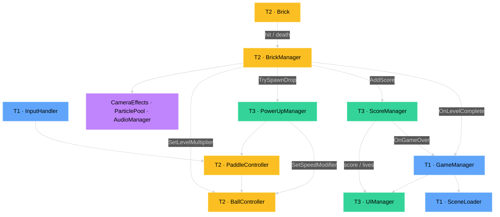
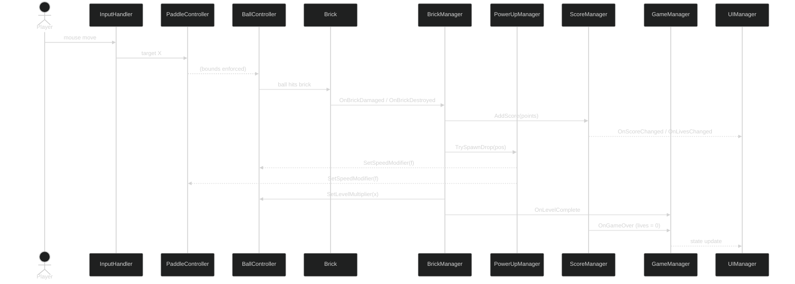
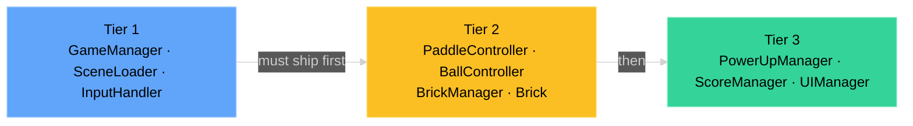

# Project Diagrams

## System Architecture

```mermaid
%%{init: {'theme': 'dark'}}%%
graph TD
    classDef t1 fill:#60a5fa,stroke:#93c5fd,color:#000000
    classDef t2 fill:#fbbf24,stroke:#fcd34d,color:#000000
    classDef t3 fill:#34d399,stroke:#6ee7b7,color:#000000
    classDef fx fill:#c084fc,stroke:#d8b4fe,color:#000000

    GM["T1 · GameManager"]:::t1
    IH["T1 · InputHandler"]:::t1
    SL["T1 · SceneLoader"]:::t1

    PC["T2 · PaddleController"]:::t2
    BC["T2 · BallController"]:::t2
    BR["T2 · Brick"]:::t2
    BM["T2 · BrickManager"]:::t2

    PU["T3 · PowerUpManager"]:::t3
    SM["T3 · ScoreManager"]:::t3
    UI["T3 · UIManager"]:::t3

    FX["CameraEffects · ParticlePool · AudioManager"]:::fx

    IH --> PC
    PC --> BC
    GM --> SL

    BR -->|hit / death| BM
    BM -->|OnLevelComplete| GM
    BM -->|AddScore| SM
    BM -->|TrySpawnDrop| PU
    BM -->|SetLevelMultiplier| BC
    BM --> FX

    PU -->|SetSpeedModifier| BC
    PU --> PC

    SM -->|OnGameOver| GM
    SM -->|score / lives| UI
    GM --> UI
```

## Communication Flow

```mermaid
%%{init: {'theme': 'dark'}}%%
sequenceDiagram
    actor Player
    participant IH as InputHandler
    participant PC as PaddleController
    participant BC as BallController
    participant BR as Brick
    participant BM as BrickManager
    participant PU as PowerUpManager
    participant SM as ScoreManager
    participant GM as GameManager
    participant UI as UIManager

    Player->>IH: mouse move
    IH->>PC: target X
    PC-->>BC: (bounds enforced)
    BC->>BR: ball hits brick
    BR->>BM: OnBrickDamaged / OnBrickDestroyed
    BM->>SM: AddScore(points)
    SM-->>UI: OnScoreChanged / OnLivesChanged
    BM->>PU: TrySpawnDrop(pos)
    PU-->>BC: SetSpeedModifier(f)
    PU-->>PC: SetSpeedModifier(f)
    BM->>BC: SetLevelMultiplier(x)
    BM->>GM: OnLevelComplete
    SM->>GM: OnGameOver (lives = 0)
    GM-->>UI: state update
```

## Tier Build Order

```mermaid
%%{init: {'theme': 'dark'}}%%
graph LR
    classDef t1 fill:#60a5fa,stroke:#93c5fd,color:#000000
    classDef t2 fill:#fbbf24,stroke:#fcd34d,color:#000000
    classDef t3 fill:#34d399,stroke:#6ee7b7,color:#000000

    T1["Tier 1\nGameManager · SceneLoader · InputHandler"]:::t1
    T2["Tier 2\nPaddleController · BallController\nBrickManager · Brick"]:::t2
    T3["Tier 3\nPowerUpManager · ScoreManager · UIManager"]:::t3

    T1 -->|must ship first| T2 -->|then| T3
```
